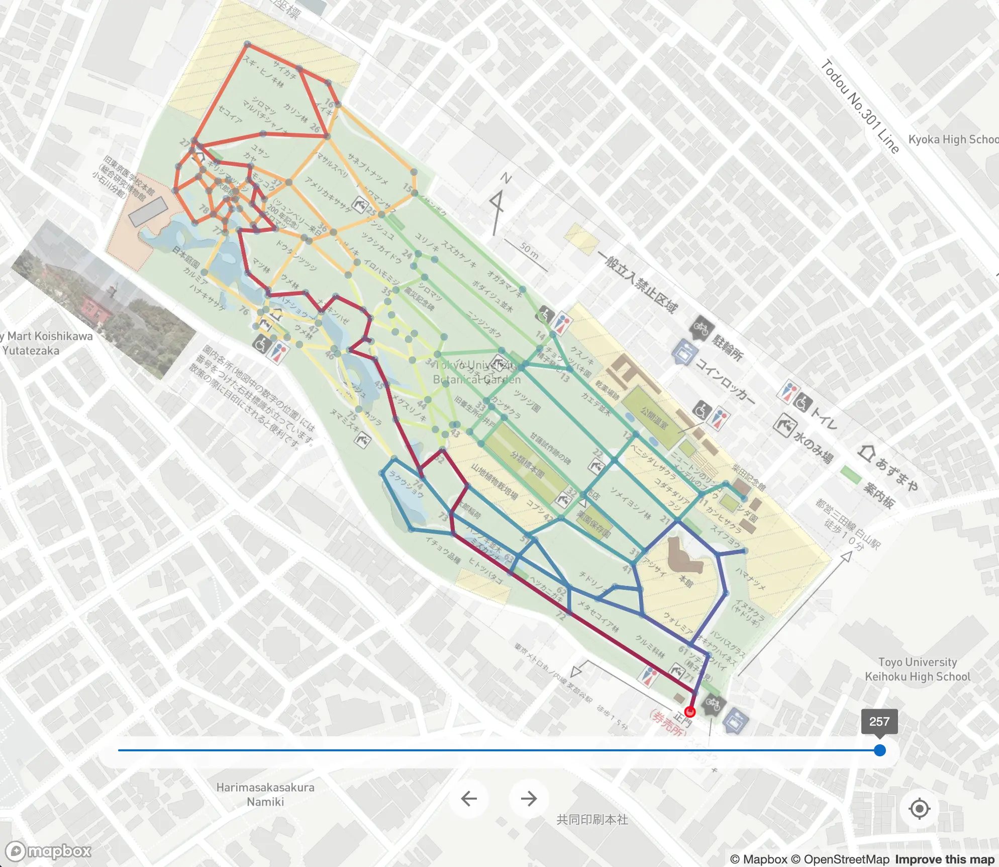

# Koishikawa Botanical Garden Optimal Path Finder
https://sw1227.github.io/kbg-map/path/

Discover the shortest route that traverses every path in the Koishikawa Botanical Garden at least once. This application leverages the Chinese Postman Problem to determine the optimal route.

## Features
- **Optimal Path Discovery**: Enter the Koishikawa Botanical Garden from the main entrance and find the shortest route ensuring you experience every path at least once.
- **Interactive Path Slider**: Fine-tune the display of the route using the on-screen slider. Focus on segments of the route or view the entirety of your journey.
- **GPS**: Show your current location within the garden.

## Usage
1. Open the [application](https://sw1227.github.io/kbg-map/path/).
2. View the optimal path that traverses every route in the garden.
3. Utilize the slider to focus on specific segments of the route.
4. Turn on the GPS feature to track your live position.
